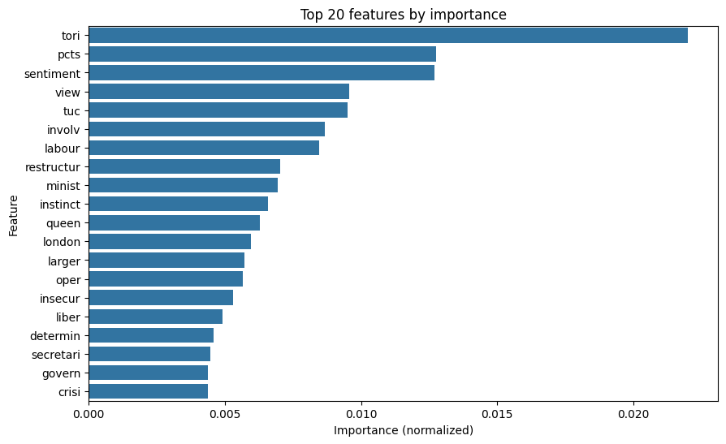
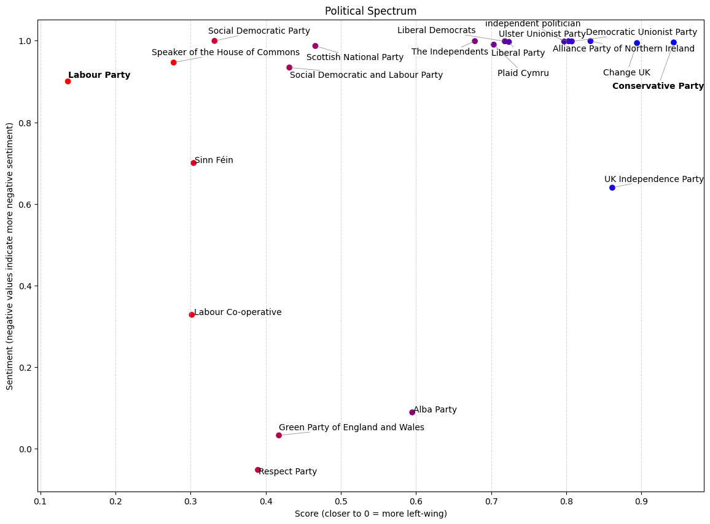

# UK Politics: From Words to Votes

## Overview

The UK Politics project, dubbed "From Words to Votes," aims to classify speeches made by UK politicians into either the Labour Party (left-wing) or the Conservative Party (right-wing) using Natural Language Processing (NLP) techniques. The project utilizes a dataset of ~12k speeches scraped from the [UK Politics website](https://www.ukpol.co.uk/) along with a list of every Member of Parliament (MP) and their respective political party affiliations.

## Project Goals

The primary goal of this project is to build a machine learning model that can accurately "score" speeches based on the political party affiliation of the speaker. Specifically, the project involves:

- Preprocessing the speech data through tokenization, stop words removal, custom cleaning rules, stemming, sentiment analysis and vectorization using TF-IDF.
- Training and validating the model using speeches from speakers affiliated with either the Labour Party or the Conservative Party, with the remaining speeches reserved for the test set.
- Utilizing a XGBoost Regressor model for prediction.
- Calculating a score ranging from 0 to 1 (left to right-wing) for each speech in the test set, allowing for the plotting of a political scale for each political party in the UK.

## Dataset

The dataset comprises:
- ~12k speeches from UK politicians.
- A list of MPs and their political party affiliations.

## Preprocessing Steps

The following preprocessing steps were applied to the speech data:
- Removal of null speeches and MPs who changed party over the years.
- Filtering speeches older than year 1970.
- Tokenization.
- Stop words removal.
- Custom cleaning rules.
- Stemming.
- Sentiment analysis.
- Vectorization using TF-IDF.

## Model Used

The XGBoost model was selected for its ability to handle high-dimensional data and provide explainable results.

## Results

The model achieved **0.34 RMSE** on the validation set. By predicting a score for each speech and aggregating the results, a political scale was plotted for each political party in the UK, providing insights into their ideological positioning and sentiments conveyed through their speeches.

### Feature Importance

	

### UK Political Party Spectrum

	

## Repository Structure

- `data/`: Contains the raw datasets.
- `results/`: Contains visualizations and evaluation metrics.
- `code.ipynb`: Jupyter notebook for data exploration, preprocessing, model training, and evaluation.
- `README.md`: Provides an overview of the project.
- `requirements.txt`: Python librairies requirements list.

## Future Work

Potential areas for future work include:
- Fine-tuning the model parameters for improved performance and to fix the overfitting.
- Exploring additional features or models to enhance accuracy.
